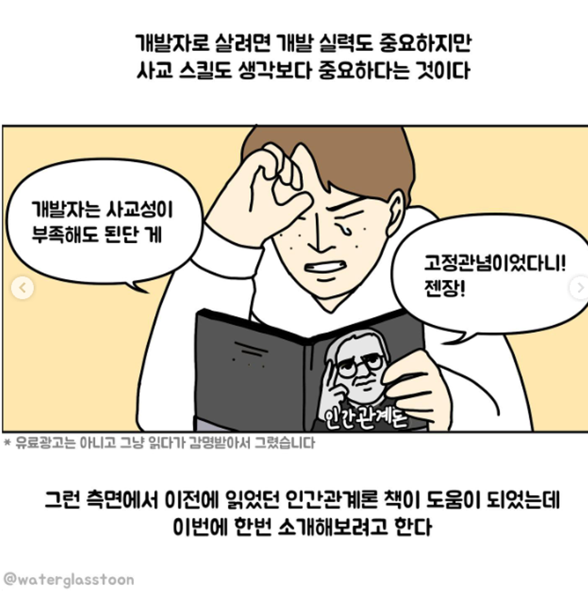
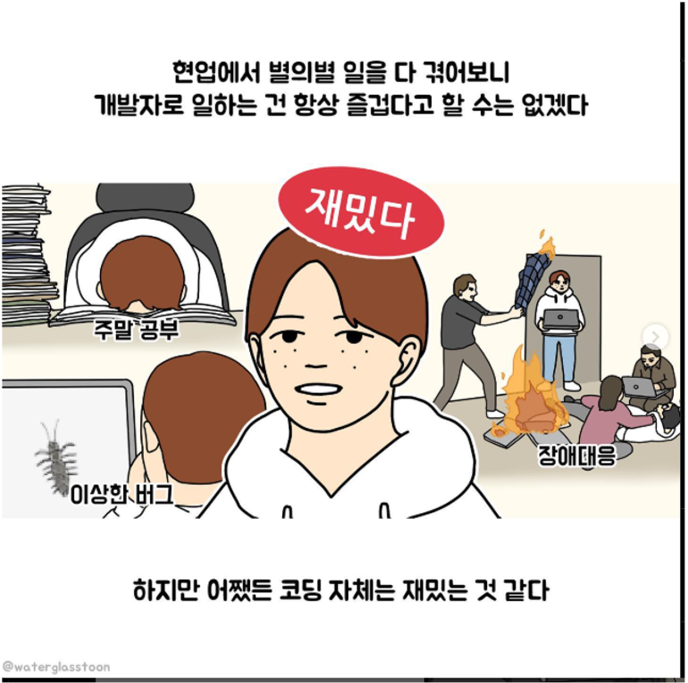
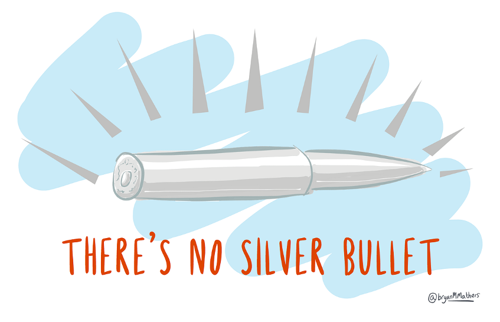
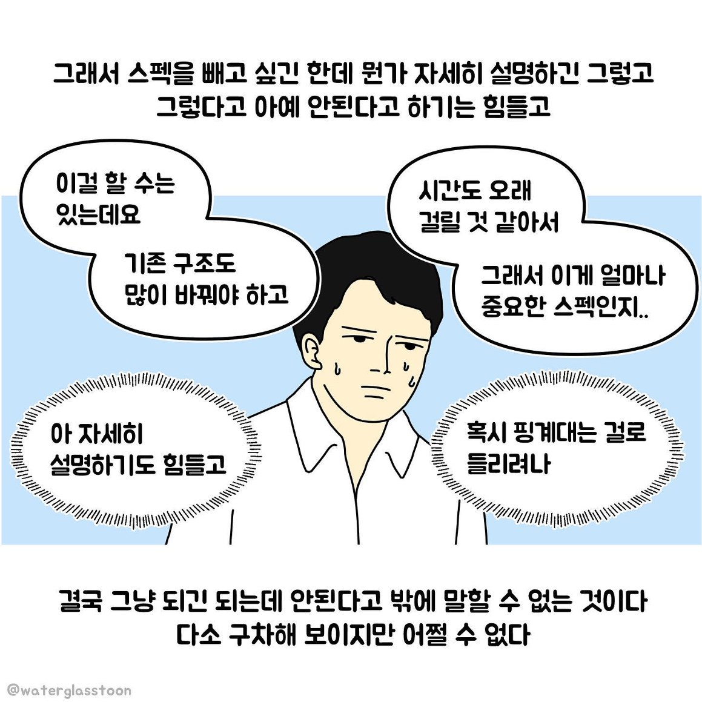

```markdown
---
title: 1년간의 전업투자 도전기
author: 서영학
---

# 1. 자기소개 & 배경

## 금융AI에서 시작된 인연

- **2023년** 금융AI서비스 개발팀 근무
- 그전에도 주식을 조금씩 하고 있었지만, 10월쯤 제대로 공부 시작
- 금융 데이터를 다루면서 시장에 대한 관심이 깊어짐

> Note: 가볍게 자기소개. 금융AI팀에서 일하면서 자연스럽게 주식에 관심을 갖게 된 계기를 이야기합니다.

---

## 2023년 12월 — 예고 없는 폭파

- 윗선 지시로 금융AI센터 폭파
- 원피스의 임처럼, 위에서 "없애라" 해서 하루아침에 팀 삭제
- 갑작스러운 조직 변화에 직면


> Note: 조직 해체가 갑작스러웠다는 점을 강조. 여기서 커리어에 대한 고민이 깊어졌음.

---

## 2024년 — 새 팀, 새 이미지

- 계정플랫폼 팀으로 반이동 (회사 내 팀이동 시스템)
- "금융AI에서 왔다" → 주식을 잘하는 사람으로 이미지 메이킹
- 실제로는 아직 배우는 중이었지만...



> Note: 금융AI 출신이라는 이유만으로 주식 전문가 취급 받았던 에피소드를 재미있게 풀어봅니다.

---

## 2025년 — 양지와 음지

- **양지:** 부트캠프 강사
- **음지:** 전업투자자 (미장 + 국장)
- 두 가지 삶을 병행하는 1년의 시작



> Note: 양지/음지 표현으로 분위기를 가볍게 가져갑니다. 실제로 두 개의 일을 병행했다는 점이 포인트.

# 2. 왜 도전했나

## 잃을 거면 일찍 잃자

- 학생 때 잃으면 → **10만원**
- 사회초년생 때 잃으면 → **100만원**
- 지금 잃으면 → **1,000만원** (그래도 벌 수 있다)
- 은퇴하고 잃으면 → **억 단위** (벌 수 있을까?)


> Note: 핵심 메시지: 젊을 때 실패의 비용이 가장 싸다. 시간이 지날수록 리스크가 커진다는 점.

---

## 1년 항해 계획

- **1~2월:** 주식 집중 (연초 시장 흐름 파악)
- **3~5월:** 강사 활동 (수입 확보)
- **6월:** 개인 프로젝트
- **7~10월:** 주식 집중 (하반기 본격 트레이딩)
- **11~12월:** 강사 활동 (연말 수입 확보)

> Note: 주식만 한 것이 아니라 강사 수입으로 생활비를 충당하면서 투자한 구조를 설명합니다.

# 3. 2025년 주식 시장 요약

## 2024년 말 — 폭풍 전야

- **트럼프 당선** → 일론 머스크, 미국 정부효율부(DOGE) 장관 임명
- 미국 우선주의 정책 기대감으로 시장 변동성 증가
- **한국 탄핵 사태** → 국내 정치 불안 + 조기 대선 가능성
- 환율 급등, 외국인 자금 이탈

> Note: 2024년 말 두 가지 대형 이벤트가 2025년 시장의 방향을 결정지었습니다.

---

## 2025년 1월 — 양자컴퓨터 버블 붕괴

- GTC에서 젠슨 황 발언: "양자컴퓨터, 실용화까지 15~30년"
- 양자컴퓨터 관련주 **반토막** (IonQ, Rigetti 등 50%+ 하락)
- 과열된 기대감이 한순간에 무너진 사례
- 교훈: 테마주의 위험성



> Note: "양자컴퓨터도 상장을 해?" 라는 냉소적 반응과 함께 테마 투자의 위험성을 이야기합니다.

---

## 2025년 3~4월 — 관세 폭탄

- 트럼프, 중국산 제품 60% 관세 부과 선언
- 글로벌 공급망 재편 우려 → 반도체, 자동차 섹터 급락
- 나스닥 10% 이상 조정
- 한국 수출주 직격탄

> Note: 관세 이슈가 시장에 미친 영향을 구체적으로 설명합니다. 특히 반도체 관련주 영향.

---

## 2025년 6월 이후 — 반등과 변동성

- AI 실적 시즌: 빅테크 실적 서프라이즈로 반등 시작
- 금리 인하 기대감 + 실적 호조 → 나스닥 회복세
- 그러나 변동성은 지속 — 매크로 이벤트에 민감한 장세

> Note: 하반기 시장 분위기를 요약합니다.

# 4. 실전 성적표 & 교훈

## 수익 곡선 — 산과 골짜기

- **7~9월:** 월 수익 1,000만원 달성
- **10월 추석 전:** +2,000만원 (누적 최고점)
- **10월 추석 후 ~ 10월 말:** **-2,500만원** (급락)
- 추석 연휴 사이 미장 급변 → 손절 타이밍 놓침

> Note: 숫자를 솔직하게 공개합니다. 잘 될 때와 안 될 때의 낙차가 크다는 것이 핵심.

---

## 배운 것들

- **손절은 기계적으로** — 감정이 개입하면 손실이 커진다
- **시장의 사이클을 읽어라** — 매크로 흐름 > 개별 종목
- **수입원을 분산하라** — 전업투자만으로는 심리적 압박이 크다
- **테마주를 조심하라** — 양자컴퓨터 사례처럼 한순간에 무너진다
- **꾸준히 기록하라** — 복기 없는 투자는 도박과 같다



> Note: 1년간의 핵심 교훈을 정리합니다. 각 항목마다 구체적 에피소드를 짧게 곁들여도 좋습니다.

---

## 앞으로의 계획

- 전업투자는 아직 이르다 — 투자는 계속하되 본업 병행
- 시스템 트레이딩 공부 시작 (금융AI 경험 활용)
- 리스크 관리를 최우선으로
- "잃지 않는 투자"가 목표


> Note: 결론 슬라이드. 무모한 도전이 아니라 경험에서 배운 점을 강조하며 마무리합니다.

```

# 챕터1. 나에 대한 소개 및 전업 투자 도전 전 스토리

2023년 금융AI서비스 개발팀 

그전에도 조금씩 하고 있었지만, 10월쯤 제대로 공부 시작

---

# 2023년 12월 윗선 지시로 금융AI센터 폭파 (원피스 임처럼 위에서 없애라해서 하루 아침에 삭제) 

---

2024년 계정플랫폼 팀으로 반이동(회사 내 팀이동 시스템) 

금융AI에서 왔다니까 주식을 뭔가 잘하는 사람처럼 이미지 메이킹이 됨

---

2025년 

양지: 부트캠프 강사/ 음지 : 전업투자자 (미장, 국장)

---

---

챕터 2. 도전 요약 

왜 도전 했냐 → 잃을꺼면 일찍 잃자 

학생 때 잃으면 10만원

초년생 때 잃으면 100만원

지금 잃으면 천만원 → 그래도 벌 수 있다 

은퇴하고 잃으면 억 단위 → 벌 수 있을까?

---

주식 시장이란 커다란 바다에 돛단배하나 띄우고 항해를 시작 

나의 나침반 = 원칙 

원칙 0. 주식은 정반합이다

---

주식을 시작하고 게임을 접었다 

주식시장은 하루에도 발행되는 수많은 패치노트

- 지표발표
- 실적발표
- 정책발표
- …
- 스캔들, 찌라시, 평가반전 등등

---

분명 1,2 때 사리다가 3랩때 쇼부

패치 후 

1,2,3랩 사리다가 4랩 때 쇼부 

---

카운터 관계 (가위바위보)

패치 후 

카운터 관계 역전 (바위를 부수는 가위)

---

A 방식을 하면 돈 벌어! (정) → 강의

A를 등쳐먹는 B방식이 생김 (반)
배운 사람들이 A방식으로 시도 → 등쳐먹힘 

A방식은 사라지고 B방식도 안먹힘
다시 A방식으로 돈을 벌 수 있게됨 (합)

---

원칙 1. 큰 손실을 입으면 주식을 잠시 쉰다 

1년 사이클

1,2월 주식 / 3,4,5월 강사/ 6월 개인프로젝트 / 7,8,9,10월 주식 /11,12월 강사 

/  로 된 부분이 큰 손실 타이밍

---

수익 요약 

원칙 2. 숏은 2주 이상 가지고 가지 않는다 

1,2월 → 양자컴퓨터, 관세

관세는 분명 악재다 생각 - 그런데 생각보다 관심이 없던 트럼프 집권 초기 → 갑자기 쇼크로 다가옴

= 3월 후반 숏 2주 후 판매 (-500 손해) → 4월 숏 2배 상승 

---

5-6월 정치 테마주 손해

테마주 패턴

---

원자력은 청정 에너지다 생각 + 에너지 부족이 다가오면 원자력은 부각할 것이다  

7,8,9 월 수익 월1000 달성 

10월 추석날까지 +2000

---

미-중 무역분쟁 전쟁 가시화 

추석 끝날때쯤부터 10월말까지 -2500

노인과 바다 

---

끝