# 1. 자기소개

## 금융AI에서 시작된 인연

- **2023년** 금융AI서비스 개발팀 근무
- 그전에도 주식을 조금씩 하고 있었지만, 10월쯤 제대로 공부 시작
- 금융 데이터를 다루면서 시장에 대한 관심이 깊어짐

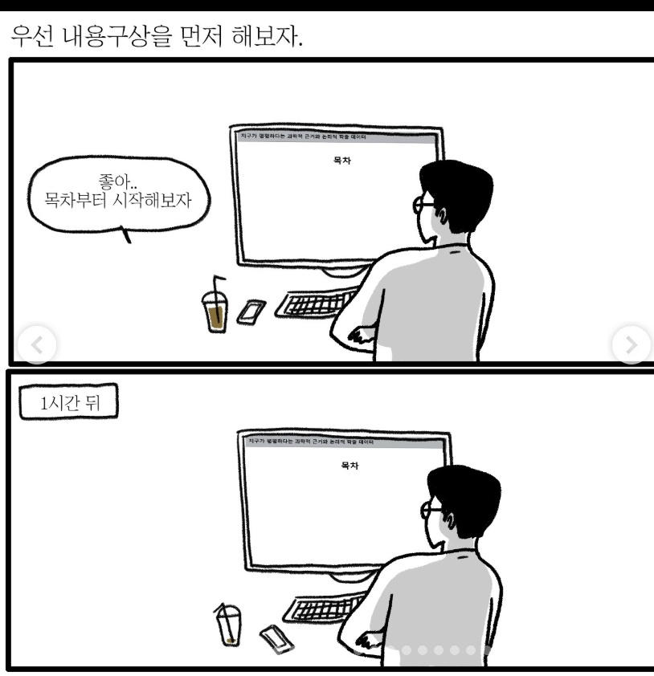

> Note: 가볍게 자기소개. 금융AI팀에서 일하면서 자연스럽게 주식에 관심을 갖게 된 계기를 이야기합니다.

---

## 2023년 12월 — 예고 없는 폭파

- 윗선 지시로 금융AI센터 해체
- 원피스의 임처럼, 위에서 "없애라" 해서 하루아침에 팀 삭제
- 갑작스러운 조직 변화에 직면

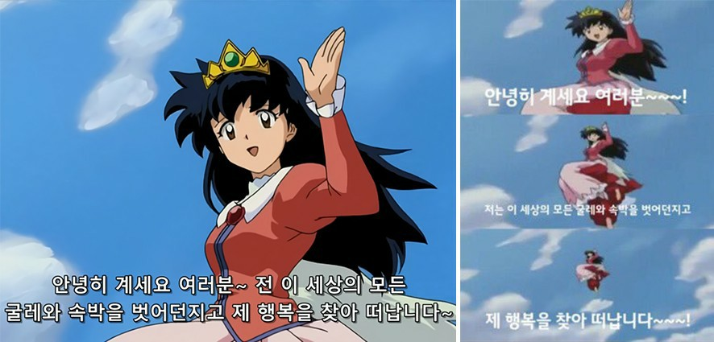

> Note: 조직 해체가 갑작스러웠다는 점을 강조. 여기서 커리어에 대한 고민이 깊어졌음.

---

## 2025년 — 양지와 음지

- **양지:** 부트캠프 강사
- **음지:** 전업투자자 (미장 + 국장)
- 두 가지 삶을 병행하는 1년의 시작

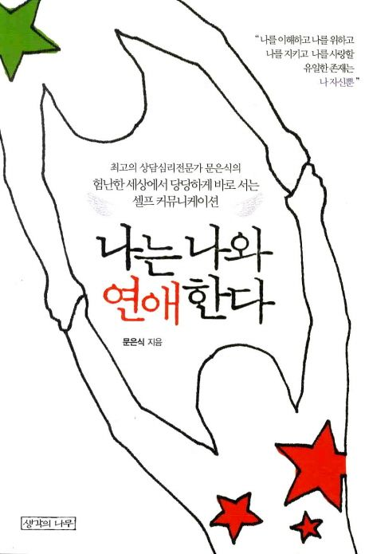

> Note: 양지/음지 표현으로 분위기를 가볍게 가져갑니다.

# 2. 왜 도전했나

!!!잃을 거면 일찍 잃자

---

## 실패의 비용은 시간이 갈수록 커진다

**10만원** 학생 때 잃으면

**100만원** 사회초년생 때 잃으면

**1,000만원** 지금 잃으면 — 그래도 벌 수 있다

**억 단위** 은퇴 후 잃으면 — 벌 수 있을까?

> Note: 핵심 메시지: 젊을 때 실패의 비용이 가장 싸다. 시간이 지날수록 리스크가 커진다.

---

## 주식시장은 끊임없이 패치되는 게임

- 주식을 시작하고 게임을 접었다
- 주식시장은 하루에도 수많은 **패치노트**가 발행된다
  - 지표발표, 실적발표, 정책발표
  - 스캔들, 찌라시, 평가반전 등등

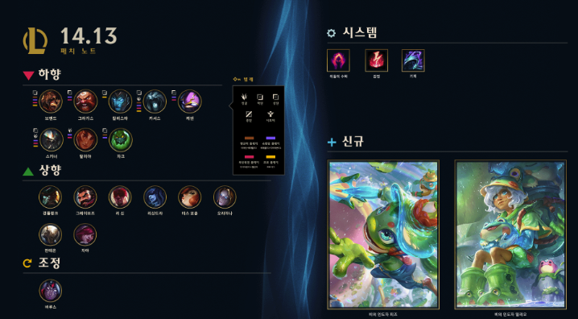

> Note: 게이머 출신답게 게임 비유로 주식시장을 설명. 롤 패치노트 이미지로 직관적으로 보여줍니다.

---

## 패치가 바꾸는 메타

- **패치 전:** 1, 2랩 때 사리다가 3랩 때 쇼부
- **패치 후:** 1, 2, 3랩 사리다가 4랩 때 쇼부
- 카운터 관계도 뒤집힘
  - **패치 전:** 가위바위보
  - **패치 후:** 바위를 부수는 가위

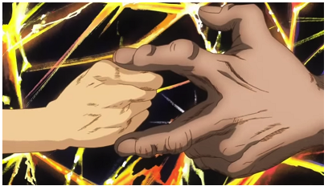

> Note: 게임 메타가 바뀌듯 주식시장도 끊임없이 변한다는 점.

---

## 주식도 마찬가지

- **패치 전:** 삼성전자는 박스권을 횡보한다
- **패치 후:** 어디까지 올라가는 거에요?
- 카운터 관계도 뒤집힘
  - **패치 전:** 한국 주식은 저평가
  - **패치 후:** 아직도 저평가인가?

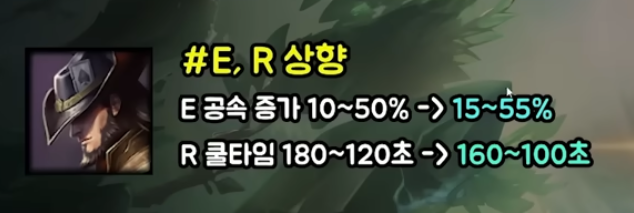

> Note: 게임 비유를 주식에 직접 대입. 구체적 사례로 청중의 공감을 이끌어냅니다.

---

!!!주식은 정반합이다

---

## 기법이 아니라 사고방법

- **정:** A 방식을 하면 돈 번다! → 강의까지 나옴
- **반:** A를 등쳐먹는 B 방식이 등장 → A로 시도하다 당함
- **합:** A도 B도 안 먹힘 → 새로운 C가 등장

> 하나의 전략에 고착되면 시장에 먹힌다

> Note: 주식 전략의 수명 주기를 정반합으로 설명. 하나의 방식에 고착되면 안 되는 이유.

---

!!!파도치는 욕망과 절망

---

## 차트에 따른 심리 변화

- **상승장:** 흥분 → 확신 → 탐욕 → "더 오른다, 더 사자"
- **고점:** 환희 → 부정 → "이번엔 다르다"
- **하락장:** 불안 → 공포 → 절망 → "다 팔아야 하나"
- **저점:** 체념 → 무관심 → "다시는 안 해"
- 그리고 다시 상승이 오면... **처음부터 반복**

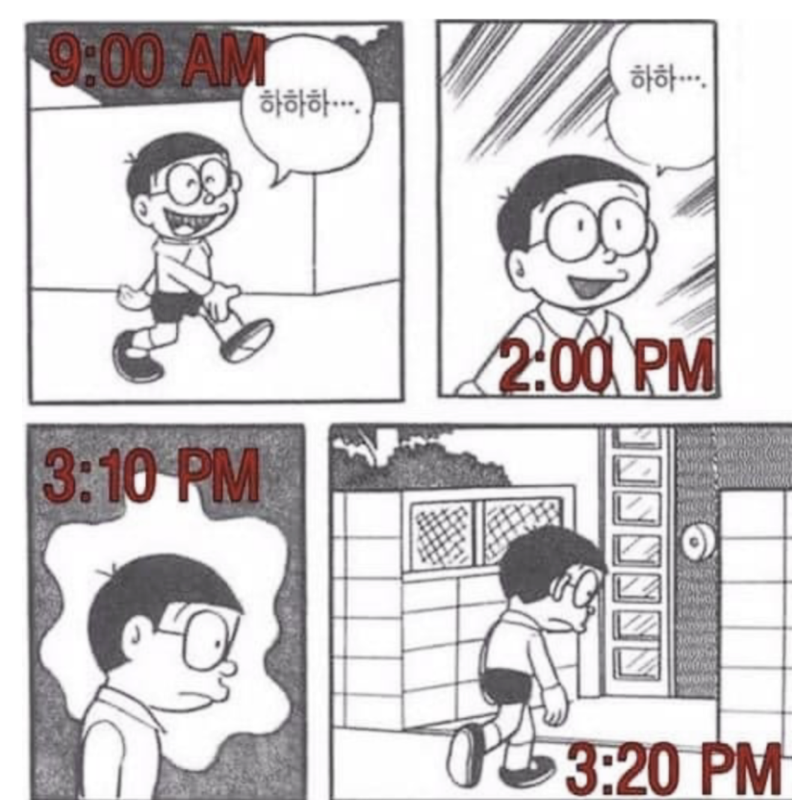

> Note: 주식 차트의 사이클과 투자자 심리는 항상 함께 움직인다. 감정을 인식하는 것이 원칙을 지키는 첫걸음.

---

## 매수 타이밍의 진실

- 남들이 "곡소리"를 낼 때가 기회
- 남들이 "축제"를 할 때가 위험
- **공포에 사고, 탐욕에 팔아라** — 말은 쉽지만 실행은...

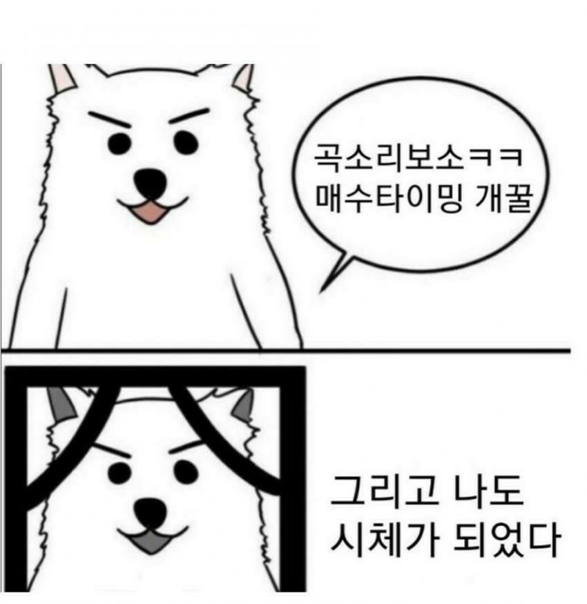

> Note: 워런 버핏의 명언을 실제 경험과 연결. 심리를 이기는 것이 얼마나 어려운지 강조.

# 3. 나의 원칙

## 원칙 1 — 큰 손실 후에는 투자를 쉰다

- 큰 손실을 입으면 주식을 잠시 쉰다
- 감정적 트레이딩 방지가 핵심
- 강사 수입이 안전판 역할

| 기간 | 활동 |
|------|------|
| 1~2월 | 주식 집중 |
| 3~5월 | 강사 활동 (수입 확보) |
| 6월 | 개인 프로젝트 |
| 7~10월 | 주식 집중 |
| 11~12월 | 강사 활동 |

> Note: 손실 후 감정적 트레이딩을 피하기 위해 강제로 쉬는 구조. 강사 수입이 안전판 역할.

---

## 원칙 2 — 숏은 2주 이상 가져가지 않는다

- **1~2월:** 양자컴퓨터 버블, 관세 이슈
- 관세는 분명 악재라 생각했지만, 트럼프 집권 초기엔 관심 밖
- 갑자기 쇼크로 다가옴

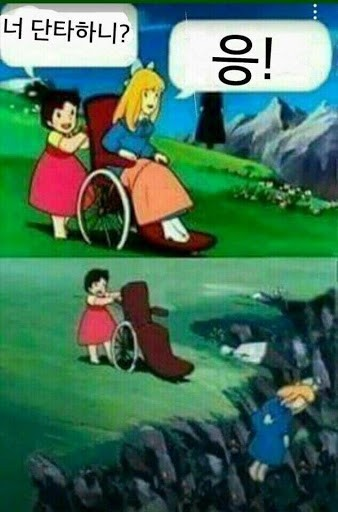

> 원칙을 지켜서 손실이 제한됐지만, 안 지켰으면 더 큰 수익이었을 수도

> Note: 원칙의 양면성. 지켜서 손해 본 경우도 있지만, 장기적으로는 리스크 관리가 핵심.

---

## 원칙 3 — 저평가된 정보가 돈이다

- **7~9월:** 투자 가설 수립
- **가설 1:** 원자력은 청정 에너지 + 에너지 부족 시대에 부각
- **가설 2:** 미중 분쟁이 확산되면 희토류가 뜬다

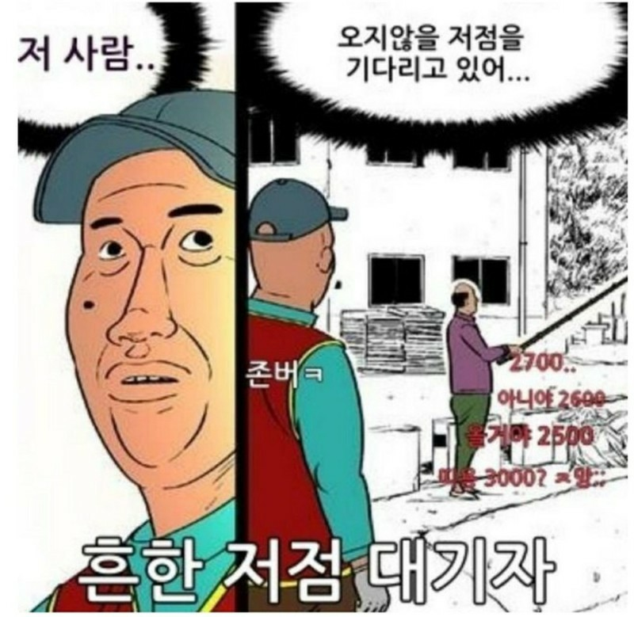

> Note: 가설 기반 투자가 맞아떨어진 시기. 정보를 남들보다 먼저 해석하는 것이 핵심.

---

## 원칙 4 — 모두 아는 호재는 악재다

- **10월:** 미-중 무역분쟁 전쟁 가시화 및 장기화
- 7, 8, 9월 벌었던 주식으로 손실 전환
- 결국 원상 복구

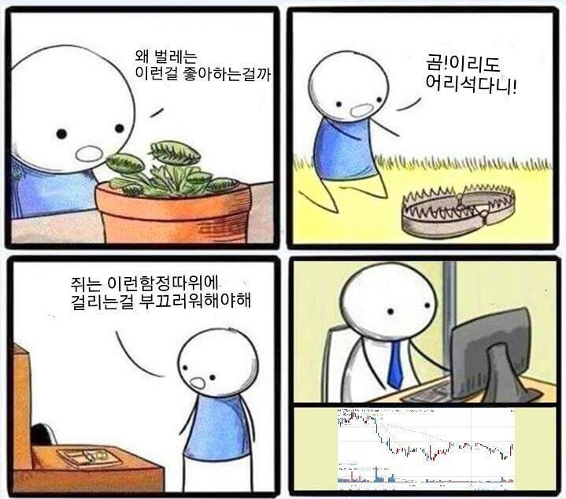

> Note: 시장이 이미 알고 있는 정보에는 알파가 없다는 교훈.

# 4. 실전 1년 기록

## 상반기 — 수업료를 내다

- **3월 후반:** 숏 2주 후 청산
- **5월:** 정치 테마주의 함정

**-500만원** 상반기 손실

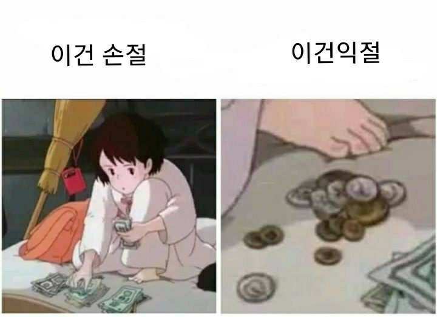

> Note: 원칙을 지켜서 손실이 났지만, 안 지켰으면 더 큰 손실이었을 상황.

---

## 하반기 — 가설이 적중하다

- 원자력 + 희토류 포지션 진입
- 확신을 가지고 배팅

**+1,000만원** 월 수익 달성

**+2,000만원** 10월 추석까지 누적

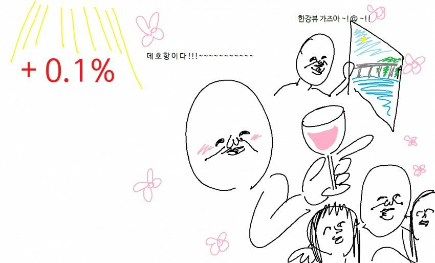

> Note: 가설 기반 투자가 맞아떨어진 시기. 수익의 쾌감과 확신이 커지던 시기.

---

## 4분기 — 다시 원점으로

- 벌었던 종목이 그대로 손실 전환
- 추석 이후 급락

**-2,500만원** 4분기 손실

- 부트캠프 강의 x3으로 생활비 확보

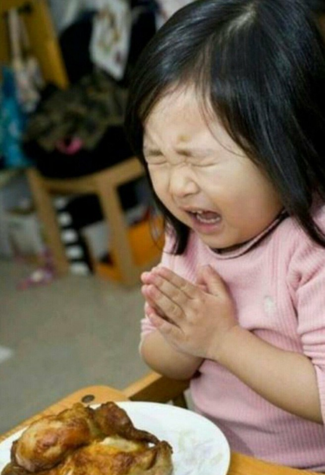

> Note: 수익을 지키는 것이 버는 것보다 어렵다는 뼈저린 교훈.

# 5. 돌아보며

!!!"큰 물고기를 잡았지만, 항구에 돌아오니 뼈만 남았다"

---

## 노인과 바다

> 헤밍웨이의 노인처럼, 수익을 잡았지만 지키지 못한 1년

- 허무함과 후련함 그 사이

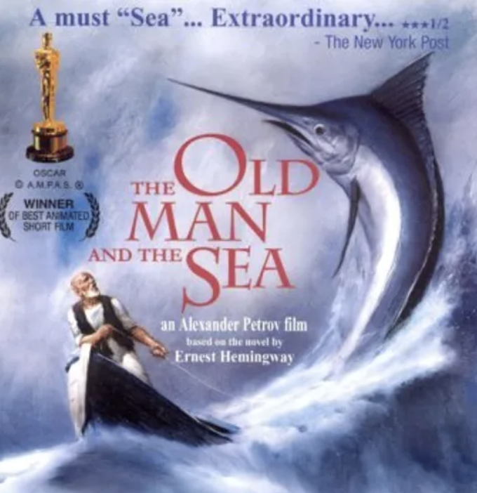

> Note: 노인과 바다 비유가 핵심. 수익을 지키는 것이 버는 것보다 어렵다는 교훈.

---

## 1년의 교훈

- 주식시장은 끊임없이 변하는 게임
- 원칙이 없으면 표류할 뿐
- 잃는 것도 배움이다
- **전업투자 최고의 수확 — 강사 커리어가 생겼다**

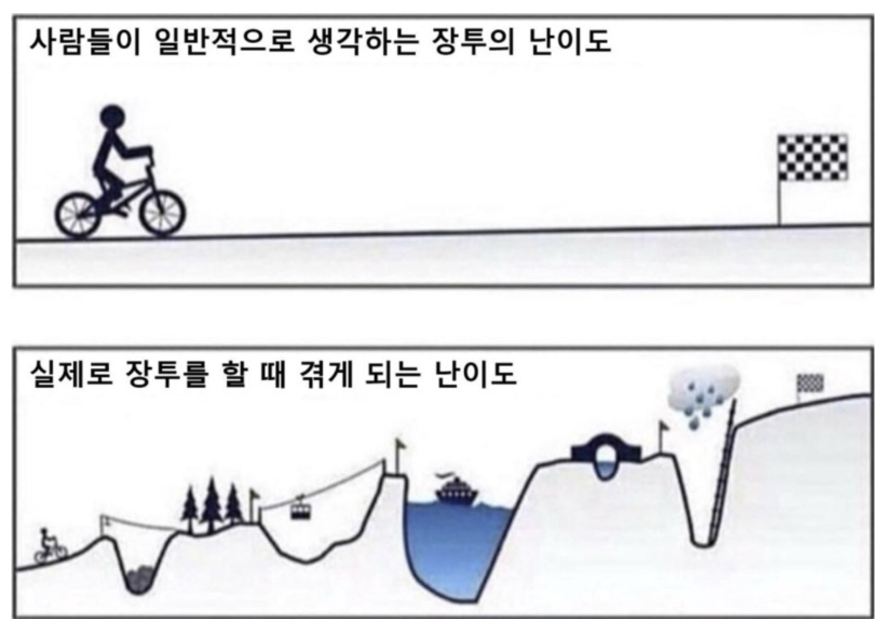

> Note: 마지막 줄에서 웃음을 유도하며 마감. 실패가 아니라 예상 못한 수확이 있었다는 반전.
