# 여는 말

## 오늘의 목표: AI와 함께 성장하기

**오늘 다룰 내용**

- 강사 소개
- AI는 현업을 어떻게 바꾸고 있는가?
- 진로 — 취업
- AI와 함께 성장하기 (총 정리 & Q&A 포함)

> Note: 걱정.. 시니어 개발자도 대체될까?

---

## 다시 하는 강사 소개: 서영학

**컴공 → AI 부트캠프 → NCsoft (NLP → AI 서비스개발/금융 → 계정 플랫폼) → 모니모니**

### 커리어

- 모니모니 (26.01~)
- 엔씨소프트 (18.01~24.12) — AI Researcher로 입사 → 백엔드 서버 개발자
  - 24년: 플랫폼센터 계정 플랫폼 개발팀
  - 23년: AI 금융플랫폼 개발팀
  - 19~22년: AI 서비스개발실 서버팀 (KBO AI 플랫폼)
  - 18년: NLP 센터 플랫폼

### 부트캠프 강사

- upstage 강원대 부트캠프 (26.01~)
- upstage 새싹프로젝트 CS part (26.01~)
- 멋쟁이사자처럼 백엔드 단기심화 4기 (25.03~06)

### 기타

- 충남대 실전코딩 — Testing 강의 (23, 24), 백엔드 강의 (22)
- 대학교 알고리즘 동아리 회장
- 17년 elice 카이스트 머신러닝 부트캠프 — 최우수상
- 16년 ACM-ICPC 대전 본선

### 블로그 / GitHub

- inspire12.tistory.com
- github.com/inspire12

# AI는 현업을 어떻게 바꾸고 있는가?

## 기술의 발전은 늘 일의 방식을 바꿔왔다

**개발자는 기술의 변화를 제일 빠르게 받아들이는 직업**

- 예전에도 개발자는 새로운 기술에 대한 열린 마인드와 공부가 필요
- 더 많이 체감이 되는 것 같다
- 오픈소스 생태계와 플랫폼 안에서 개발자들은 자신이 쓰는 도구에 대해 자신의 의견을 제시, 창조할 수 있다
- 장인은 도구 탓을 하지 않는다
- = 장인은 도구를 직접 만들 수 있다 + 공유 → 오픈소스

> 출처: https://www.excellentwebworld.com/ai-assisted-software-development/

---

## 프로세스(=섬) 안에서 역할

**KnowHow → KnowWhere**

- 공부할 양에 질려버리면 안된다
- 하나를 우선 알고 사용하다 보면 도구에 대한 역할을 이해하게 된다 (bottom-up 방식)
- 개발환경과 도구에 대한 사용법을 익히면 그 카테고리와 workflow 에 대해 이해
- 새로운 것들을 받아들이는 속도가 빨라진다
- 기존의 개발환경에 단점을 보완하기 위해, 혹은 새로운 워크플로우를 제안하는 도구들이 수없이 출시 중
- 이 중 몇 개가 공감대를 얻어 채택된다
- 해당 도구들을 장난감을 다뤄보듯 사용해보는 습관이 필요 (ex: Docker)

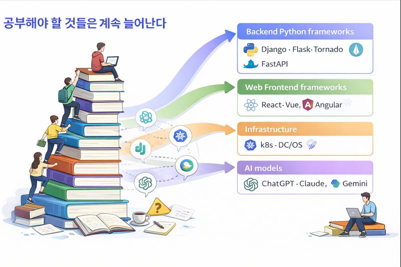

---

## 진로별 준비할 것들

**먼저 구조화, 다음에 단계별**

- 배울 게 많으니 먼저 전체 지도를 그리자
- 카테고리 → 도구 → 개념 순서로 훑기
- 단계별 체크리스트로 '아는 것 / 모르는 것' 구분

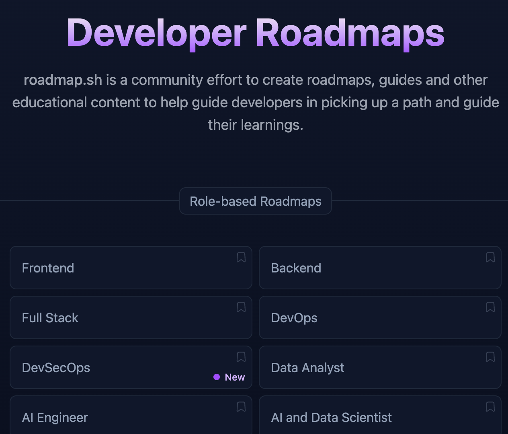

> 출처: https://roadmap.sh

> Note: 로드맵은 정답이 아니라 지형도 — 실제 경로는 내가 만든다. 한 직군을 먼저 훑고 관심 가는 가지를 깊게 파면 된다.

---

## 하지만 최근 변화 속도는 너무 빠르다

**AI 코딩이 도입된 건 불과 반년**

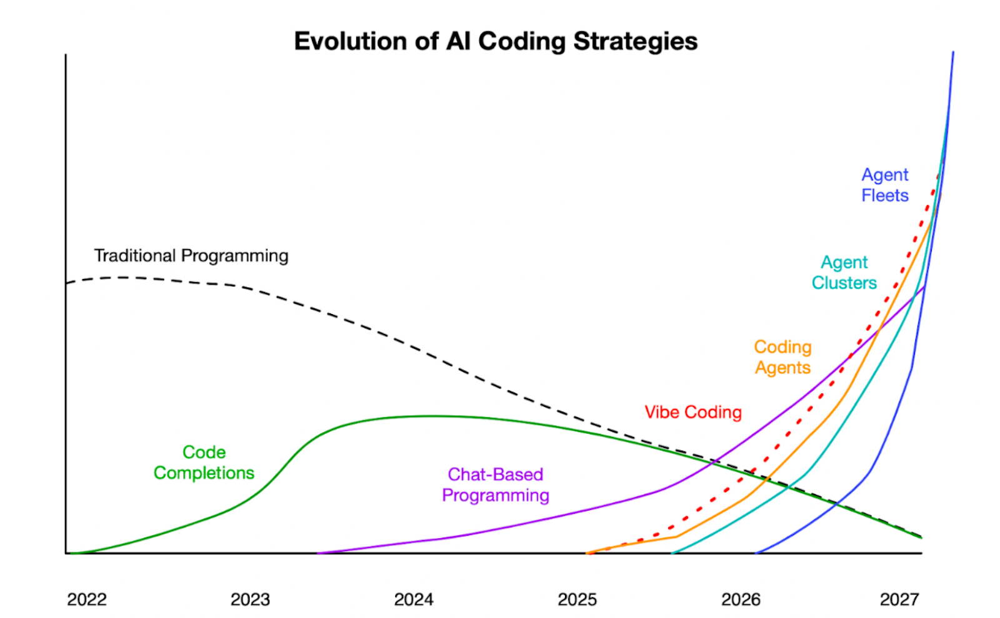

> 출처: https://aisparkup.com/posts/401

---

## (현재) AI 에이전트의 등장으로 바뀐 개발 환경

**AI 에이전트와 AI 코딩 = 동료로서 AI**

- 현장에서 체감되는 AI의 역할
- 실제로 양질의 코드를 만들어주는 AI
- AI는 보조가 아닌 주체
- 개발자는 코딩 보다 AI가 만들어진 Pull Request를 리뷰하는데 시간을 쓴다
- 모든 개발자가 시니어 개발자, CTO 처럼 일하게 된다
- 불과 반년 전에 시니어 개발자에게 요구되던 덕목들이 여러분들을 평가하는 기준이 될 것이다 → 면접 질문 / 취업 후 할 일

> Note: 이게 미래가 아니라 현재. AI가 코드를 짜고 사람은 리뷰한다.

---

## 모든 개발자는 시니어 개발자처럼 일해야한다

**현재 주니어 개발자의 역할이 대체**

- 서비스를 만드는 전체 프로세스
- 코딩과 구현 기술은 개발의 일부이지 개발의 전부는 아니다
- 프로세스 내에서 손이 많이 가던 귀찮은 일들이 편해진다
  - 검증, 코드리뷰, 테스팅, 단순 개발, 반복 등
- 혼자 모든 프로세스를 "감독"할 수 있게 된다
- 개발자는 더 중요한 일, 본질에 집중할 수 있게 된다

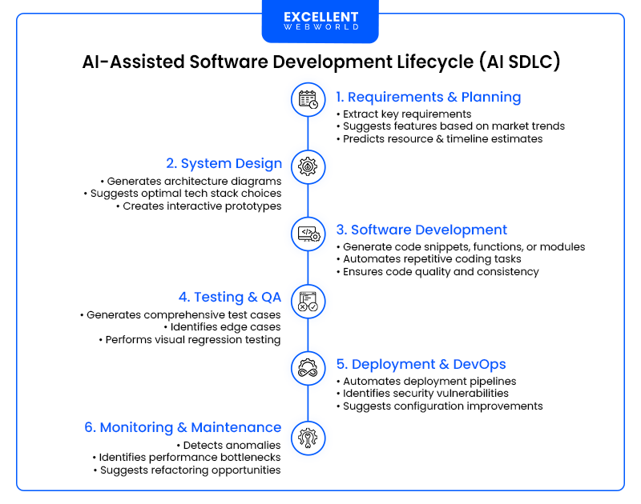

> 출처: https://news.hada.io/topic?id=25574

---

## 코드 리뷰는 아직 필요하다

**AI는 책임을 지지 않는다**

- 일을 하는 방식/프로세스를 이해
- 협업하는 프로세스를 경험해야 한다
- 그 협업의 대상이 AI로 변화
- AI에게 제약을 주고 올바른 방향(plan)을 세우는 일
- 로직 검증 >> 가독성, 컨벤션 > 최적화

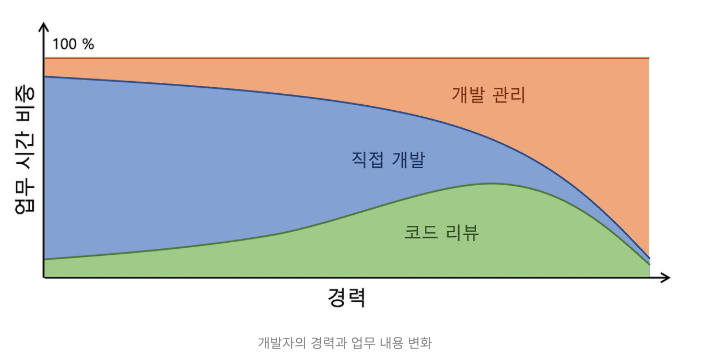

> 출처: https://brunch.co.kr/@mbook/21

---

## AI 코딩과 기존 코딩의 생각 과정 차이

**개발자들의 관점**

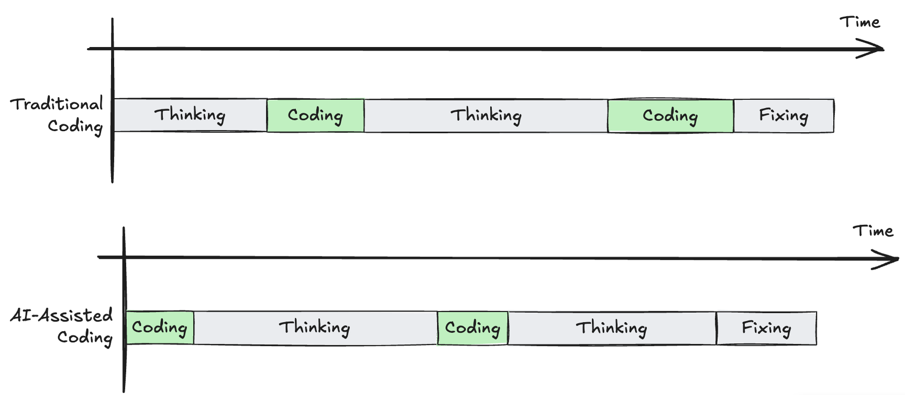

> 출처: https://chrisloy.dev/post/2025/09/28/the-ai-coding-trap

---

## 기존 개발자들의 의견 1: 재미가 사라졌다

**코드를 짜는 재미, 과정의 재미가 사라졌다**

> 코드를 짜면서 생각하는 과정, 다른 레퍼런스들을 찾아보고 모르는 것들은 검색하고 공부하며 알아가던 과정이 사라지고, 모든 게 프롬프트+검수 정도로만 이뤄지니 너무 재미가 없네요. — zero cho

> 그런데 진짜 그런 엄청난 세상이 와버렸습니다. 회사에서 여러 사람들이 모여 매일 야근하고 한땀한땀 코딩하던 시절이 진짜 있었나? 바로 몇 년 전 일인데 90년대 이야기 아닌가 싶을 정도로 아득하게 느껴집니다. — k리그개발자

---

## 기존 개발자들의 의견 2: 다시 재밌어졌다

**개발 전 과정을 개발자가 컨트롤 할 수 있게 되었다**

> 웹 개발이 다시 재밌어지다

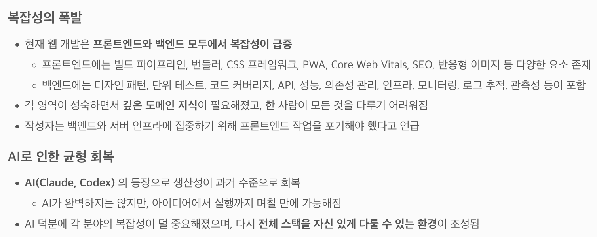

---

## 회사에서 AI 도입한 후기들

**어떤 관점과 목표를 위해 도입하고 있나?**

- **카카오** — 실시간 코드 리뷰 및 품질 관리: AI 도입의 필요성과 기대 효과
- **SK 데보션** — 조직에서 AI 코딩 솔루션 도입, 어떻게 시작할까?
- **컬리** — OMS에서 Claude AI를 활용하여 변화된 업무 방식

> 출처: https://brunch.co.kr/@mbook/21

---

## AI 코딩 이후의 맹점 1: 고급 인력 파이프라인 절단

**시니어는 뚝딱 만들어지지 않는다**

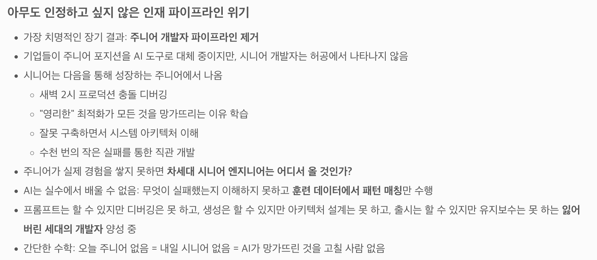

> 출처: https://news.hada.io/topic?id=23573

> Note: 목적지를 가기 위해 당장 알아야 할 건 — 앞으로 가기, 다른 경로/교차로 가는 방법. 개발자는 자격증이 크게 필요 없는 직업이다.

---

## AI 코딩 이후의 맹점 2: 수익 모델 붕괴

**붕괴되는 오픈소스 수익 파이프라인**

- **Tailwind 엔지니어 75% 해고**
- 검색이 아닌 AI 답변 중심 생태계에서는 "문서 페이지" 자체 트래픽이 감소
- 이후 Google, Lovable 등 프로젝트 후원
- 오픈소스 + AI 시대의 생존 전략과 커뮤니티 생태계 변화의 상징적 사례

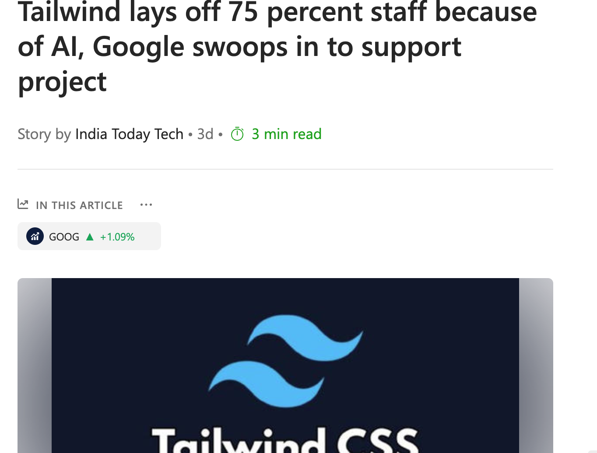

> 출처: https://github.com/tailwindlabs/tailwindcss.com/pull/2388

# 진로 — 취업

## 진로라는 것..

**어두운 길에 네비게이션을 찍고 도착을 기대**

!!!불안과 초조 vs 성장

- 운의 요소가 크게 작용된다
- 내가 취업한 상황과 여러분의 상황은 다르다
- 이 분야를 이야기하는 게 조금 조심스러운게 사실
- 1년 뒤, 또 1년 뒤가 바뀌어 있다

---

## 주변 사람을 개발자로 바꾸기

**개발자는 성향이 맞아야 한다**

- 스터디 모집 — 공부를 하고자 하는 사람과 함께
- 목적을 가진 단기 스터디 → 그 안에서 새로운 스터디
  - ex) 개발 책 스터디 → 취업 이력서/면접 스터디 → 창업
- 얻게 되는 정보와 도움이 달라진다
- 부트캠프, 개발자 모임

---

## 잘하는 사람들의 코드를 읽어보기

**오픈소스 + AI 를 통한 분석**

- 주변에 코딩을 잘하는 사람(멘토)이 있다면 좋겠지만, 현실적으로 힘들다
- 규모가 있는 오픈소스는 커뮤니티 / Discussion / Issue 등 협업 채널이 잘되어 있다
- 이런 식으로도 코드를 짜는구나, 좋은 코드가 무엇인가, 틀을 깨는 사고
- 내가 쓰는 기능은 이렇게 구현되고 있구나
- 이 정도는 나도 기여할 수 있겠는데 + 이런 기능을 추가하면 어떨까?
- AI를 통해 코드를 이해하는 과정이 쉬워졌다

---

## 채용 공고에서 공부할 키워드 얻기

**무엇을 공부해야 하나?**

- 현재 회사(도메인별/규모별)에선 어떤 도구를 사용하고 있을까 + 왜 이 도구를 사용하고 있을까?
- 내가 가고 싶은 회사 채용 사이트 확인
  - ex) 당근마켓 + 채용 + (직책)
- 채용 공고를 캡처 후 저장 (기간이 지나면 사라짐)

> 출처: https://zighang.com

> Note: 나는 회사가 어떻게 일하는지 궁금했다.

---

## 예시: 토스증권 백엔드 개발자 공고

**공고 한 장에서 뽑아낼 수 있는 공부 키워드**

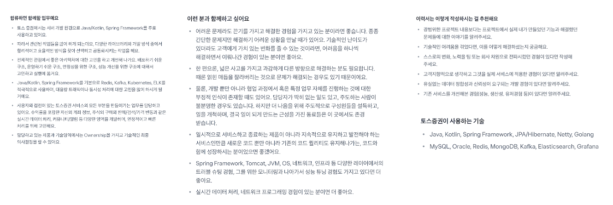

> Note: 도메인(증권·실시간 체결/호가), 언어(Kotlin+Spring), 인프라(K8s·Kafka·Redis), 품질(테스트/모니터링), 협업(코드 리뷰) — 공고 한 장만 꼼꼼히 읽어도 "무엇을 공부할지 + 왜 필요한지" 로드맵이 나온다.

---

## 채용 프로세스와 준비할 점 점검

**회사의 채용 프로세스와 회사에 가기 위한 준비 / 키워드 / 실력**

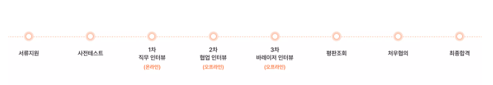

> 출처: 강남언니 채용 프로세스 중 발췌

---

## 서류 지원 = 이력서를 작성하는 과정

**난 뭐했지? 왜 이렇게 부족해 보이지? — 자괴감과의 싸움**

### 작은 것부터 쌓기

- 부트캠프
- 공모전 / 해커톤
- 개인 블로그에 글쓰기
- 개인 앱 제작 및 홍보

### 최근 취업한 사람 / 잘하는 사람의 이력서 읽어보기

- 이 정도는 해야 취업할 수 있구나
- 생각보다 더 알아야 되는구나

---

## 이력서 작성하기

**ex) 개발자 이력서**

### 첫 장

- 이름 + 한 줄 요약
- 소개: 경험, 업무 스타일
- 커리어 요약
- 할 수 있는 스킬

### 둘째 장부터

- 실제 프로젝트 진행
- 메인 작업, 작업 중 이슈와 해결 등
- 문제 해결을 위해 고민한 흔적이 있어야 한다

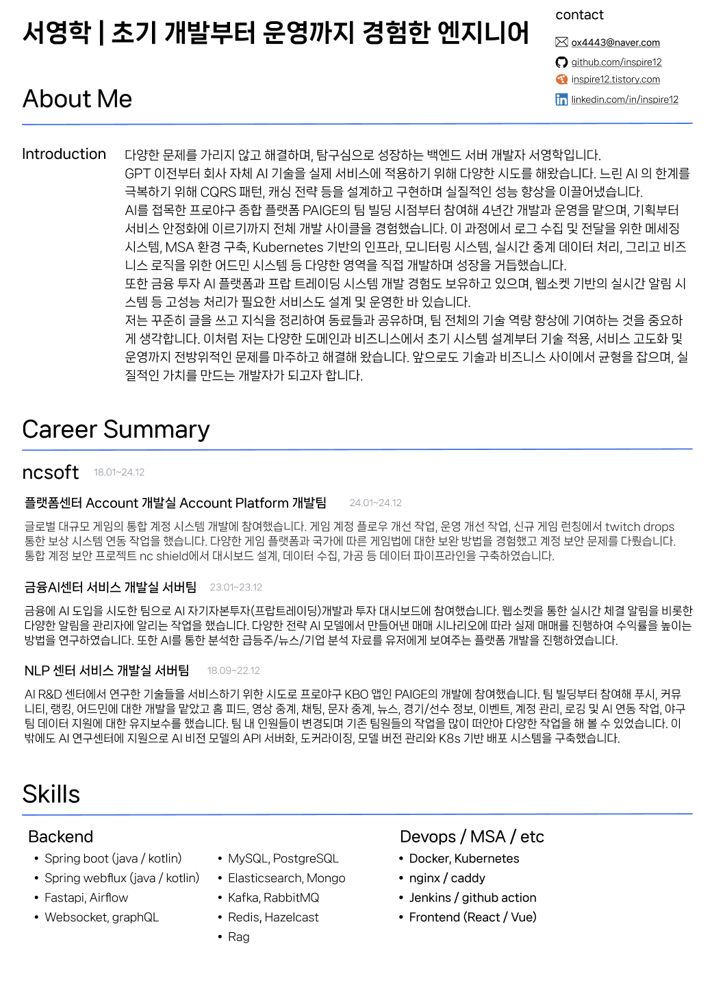

---

## 코딩 테스트 / 과제 테스트 / 코드 리뷰

**현장에서의 고민 — 변별력**

- **코딩 테스트** — "똑똑한 사람을 뽑겠다". AI가 잘하는 영역이라 문제 유형이 생기는 경향
- **과제 테스트** — 작년 초부터 퀄리티가 상향 평준화 → 변별력을 찾기가 쉽지 않아짐
- 시험 기간 동안 감시를 한다? 현실적인 우회 방법이 너무 많다

---

## 코드 리뷰로 과제 테스트를 대체?

**아직 대세는 아니지만, 충분히 변별력이 생길 만한 과정**

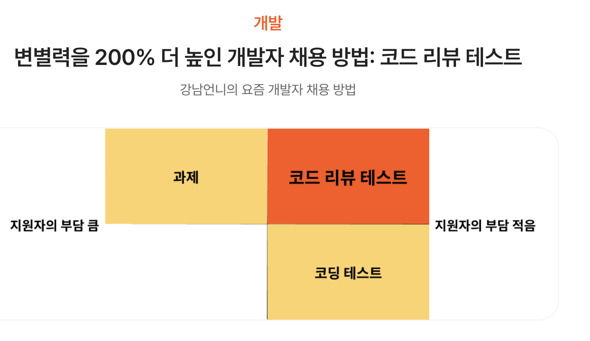

> 출처: https://blog.gangnamunni.com/post/code-review-test

---

## 기술 면접 / 코드 리뷰 / 컬처 면접

**연습이 필요하다**

- 기술을 설명해보기 / 기술에 대한 내 생각을 이야기해보기, 기술 블로그
- 면접 스터디 + 녹화, 스크립트
- 면접 관련 책(면접 노트) / 면접 후기 읽기
- 면접 질문 진행해보기
- 소프트스킬에 대한 생각 적어보기
- 회사 인재상 등 읽어보기

---

## 채용은 사람과 하는 일

!!!나는 나와 같이 일하고 싶은가?

- **맥락을 이해하려는 태도** — 비즈니스에 대한 이해, 단순 구현보다 의도 파악 (전술을 이해하려는 태도)
- **코드 리뷰를 받을 준비** — 지적을 개인 평가로 받아들이지 않기
- **질문을 잘 하는 능력**
  - 막연한 질문 ❌
  - 시도한 것 + 막힌 지점 + 가설을 포함한 질문 ⭕
- **새로운 기술에 대한 열린 마인드**

---

## 현실적인 학교가 제공하는 것

**개발자로 성장할 수 있는 환경**

- **동료 & 선후배** — 가장 큰 가치. 정보와 모티베이션을 주는 사람들
- **기초 학문** — 자료구조, 알고리즘, OS, DB, 네트워크 — 현업에서도 계속 돌아오는 기반
- **동아리 / 학회** — 알고리즘, 보안, 웹, AI — 관심사 맞는 사람과 프로젝트
- **공모전 & 해커톤** — 학교 네임택으로 참여 기회가 넓다
- **교수님 / 연구실** — 학부 인턴, 논문, 산학 프로젝트
- **시간과 실패의 공간** — 취업 전 마음껏 시도해볼 수 있는 유일한 시기
- **커리어 서비스** — 취업 상담, 이력서 첨삭, 기업 설명회

# AI와 함께 성장하기

## AI가 잘해주는 것 vs 못하는 것

**레벨을 나눠 생각하자**

- **AI가 잘하는 영역** — 보일러플레이트, 단순 리팩터링, 문서/주석, 테스트 코드, 번역, 익숙한 패턴
- **사람이 해야 하는 영역** — 요구사항 해석, 도메인 판단, 아키텍처 결정, 트레이드오프, 장애 원인 추적
- 새로운 도구에 열린 자세가 중요 — 오히려 **주니어가 더 잘 열려 있다**
- "AI가 해주니까" 가 아니라 "AI에게 **시킬 수 있는 사람**" 이 되어야 한다

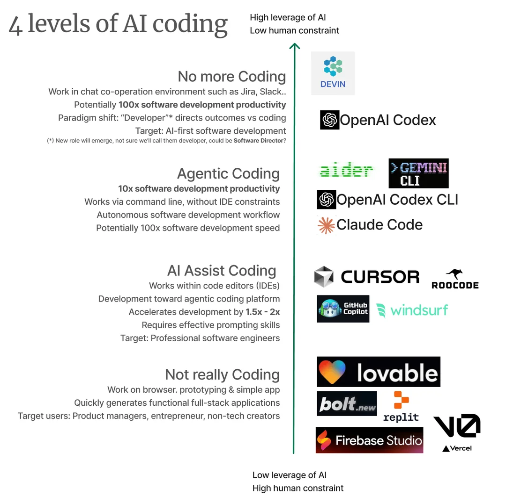

---

## AI와 어떻게 협업할까?

**지시가 아니라 컨텍스트를 준다**

- **맥락을 충분히 준다** — 어떤 서비스인지, 제약은 뭔지, 기존 코드 스타일은 어떤지
- **플랜을 먼저 세우게 한다** — 바로 구현 X, 단계별 계획 → 검토 → 실행
- **작은 단위로 쪼갠다** — 한 번에 한 가지 일만. PR 크기로 나눠 리뷰 가능하게
- **결과를 검증한다** — AI가 짠 코드도 로직/엣지케이스는 사람이 확인
- **반복 대화로 다듬는다** — 한 번에 완성되지 않음. 피드백 루프가 핵심

> Note: AI를 "부하 직원" 이 아니라 "맥락을 공유하는 동료" 로 대하는 감각이 중요.

---

## AI 시대의 새로운 핵심 역량

!!!프롬프트보다 컨텍스트, 컨텍스트보다 판단력

- **컨텍스트 설계** — 무엇을 주고, 무엇을 안 줄지 고르는 능력
- **좋은 질문 능력** — 모호함 없이 의도를 언어화하는 훈련
- **검증 능력** — AI 결과를 빠르게 읽고 진위·품질 판단
- **시스템적 사고** — 코드 한 줄이 아니라 전체 흐름 안에서 판단
- **기초 체력** — CS 기본기, 디버깅 감각, 설계 원칙은 여전히 필수

---

## AI가 대체하지 못하는 것

**껍질은 AI, 뼈대는 사람**

- **문제 정의** — "뭘 만들어야 하는지" 는 사람 몫
- **책임** — 잘못된 코드의 결과는 사람이 진다
- **도메인 이해** — 사용자/비즈니스가 실제로 뭘 원하는지
- **트레이드오프 결정** — 속도 vs 품질 vs 비용 저울질
- **팀 커뮤니케이션** — 설득, 합의, 갈등 조정

> Note: 이런 능력은 경험과 맥락에서 온다. AI에게 넘길 수 없는 영역이라 오히려 차별점이 된다.

---

## 매일의 성장 루틴

**AI를 일상 학습에 끼워 넣자**

- **모르는 개념** — AI에게 설명 요청 → 반례/비유까지 물어보기
- **새 라이브러리** — 공식 문서 먼저, AI는 "왜 이렇게 쓰나요?" 질문용
- **코드 리뷰 받기** — 내가 짠 코드를 AI에게 리뷰 요청, 다른 접근 제안 받기
- **개념 퀴즈** — 공부한 내용을 AI에게 시험 문제로 만들어달라
- **설계 토론** — 혼자 결정하기 전에 AI와 2~3개 대안 비교

> Note: 혼자 공부할 때 가장 약했던 "질문할 사람이 없다" 를 AI가 메워준다.

---

## 현장을 모르는 관리자는 한계가 있다

**코딩은 정말 쓸데없나?**

- 탁상공론
- 개발은 사실 현장직에 더 가깝다
- 개발을 못해도 "데이터"는 볼 줄 알아야 한다

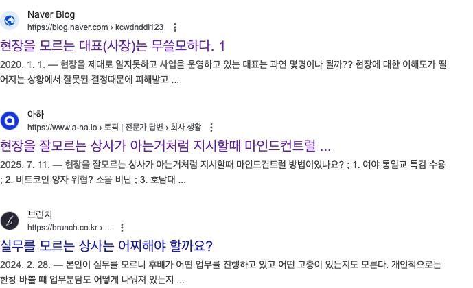

---

## 총 정리

!!!일하는 방법(프로세스)을 이해하자

### AI는 현업을 어떻게 바꾸고 있는가?

- 미래가 아니라 현재, 실제 코딩보다 리뷰 위주의 작업 방식
- 한 명의 개발자가 할 수 있는 것들이 많아졌다

### 진로: 어떻게 준비해야 하나

- 일의 변화에 따른 채용 시장 변화 — 과도기
- 시장을 보면서 준비 방법을 생각

---

## 질의응답

- 질문을 기다립니다
- github.com/inspire12
- inspire12.tistory.com
